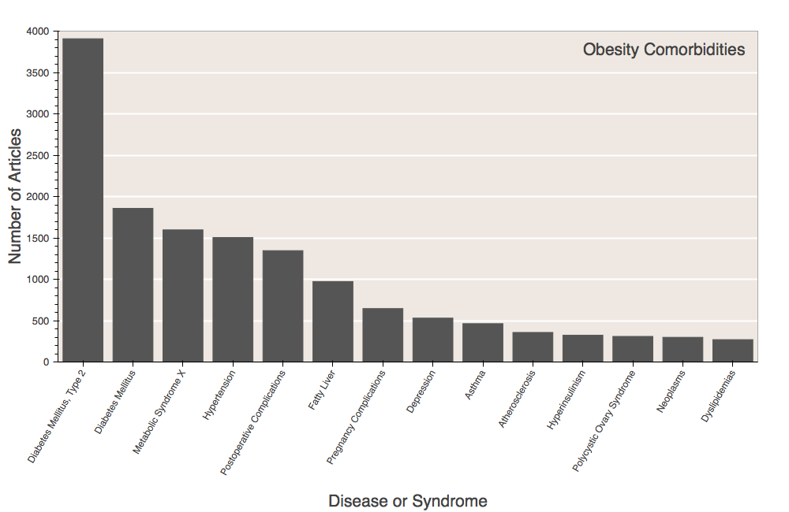
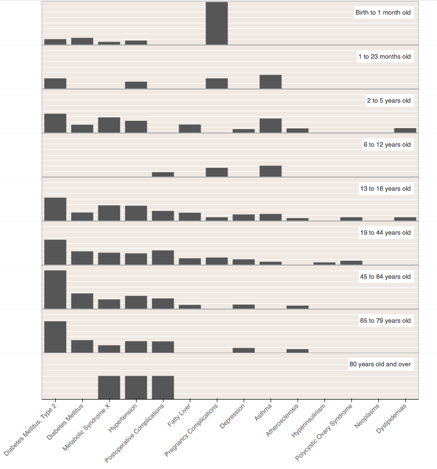

## Obesity Comorbidity Analysis

### Objective
Perform comorbidity analysis for obesity based on Medical Subject Headings (MeSH) descriptors that are used to index biomedical literature in PubMed/MEDLINE (http://www.ncbi.nlm.nih.gov/pubmed)

### Materials
- Programming Language Used: Python, with IPython and Jupyter notebook.
- PubMed/MEDLINE records via [NCBI E-Utilities](http://www.ncbi.nlm.nih.gov/books/NBK25501/)
- [MeSH Vocabulary](https://www.nlm.nih.gov/mesh/)
- [Unified Medical Language System (UMLS) Semantic Types](http://semanticnetwork.nlm.nih.gov/)

### Methods

The goal of this analysis is to explore the diseases or syndromes that co-occur with obesity. To measure that using the PubMed database, I retrieve articles published between 2000 and 2012, with 'obesity' as a MeSH Major Topic. For that I used Biopython's Entrez package that allows me to interact with NCBI's E-utilities and their databases. I retrieved a total of 59,464 articles matching that query. From those articles, I extracted the PubMed article ID, article titles, author names, MeSH descriptors and publication year. MeSH descriptors include, among other things, diseases and syndromes that are also contained in the article as a major topic. To select only the Diseases and Syndromes from the MeSH descriptors I first create a mapping of the MeSH descriptors and the Unified Medical Language System Semantic Types. The MeSH vocabulary file contains, among other things, the MeSH descriptor and a semantic type id that the descriptor belongs to (in the format 'T011'). The UMLS semantic type file contains the same id and the corresponding semantic type. Using that id as key I can map both files. After mapping those files, I can select the articles where the MeSH descriptor maps to the semantic type 'Disease or Syndrome'. After that, I simply count the number of articles that fall in each of the MeSH descriptor mapped to 'Disease or Syndrome'.
See the [source code](https://github.com/fernandogelin/comorbidity-analysis/blob/master/comorbidity-analysis.ipynb) for detailed analysis.

### Results

The results of the analysis are not surprising.  The disease that most co-occur with obesity is Diabetes Mellitus, Type 2. As shown in the figure below, Diabetes Mellitus, Type 2 occurs almost twice as much as the next most common obesity comorbidity. This means, that in most cases, obesity related to a self-inflicted disease.

Our dataset corresponds to all articles on PubMed between 2000 and 2012, and thus includes studies on subjects of different ages. I wanted to explore further the dataset to see if Diabetes Mellitus, Type 2 is more common in older people, as it is expected. The figure below shows the percentage of articles for each of the top 15 obesity comorbidities divided by age group (the age group is one of the MeSH descriptors and can also be extracted from each article).

